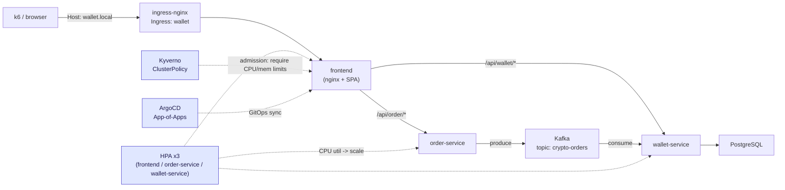

# Crypto Wallet Service

A microservices-based crypto wallet platform, deployed on **AWS EKS** with a
full GitOps toolchain: **ArgoCD** (App-of-Apps), **HashiCorp Vault** +
**External Secrets Operator**, **Kyverno** policy enforcement, **HPA**
autoscaling, and **ingress-nginx** L7 routing. Built as a hands-on platform
engineering portfolio project — the point isn't the wallet app itself, it's
everything around it: GitOps delivery, policy-as-code, secret management,
observability, and load-tested autoscaling, done the way a real platform
team would do it.

> For the secrets/GitOps control-plane flow in detail (Vault, External
> Secrets, the ArgoCD App-of-Apps wave ordering), see [architecture.md](architecture.md).
> For contributing conventions (branching, PRs, live-cluster validation),
> see [CONTRIBUTING.md](CONTRIBUTING.md). For the k6 load-testing suite, see
> [tests/performance/README.md](tests/performance/README.md).

## Table of Contents

- [Architecture](#architecture)
- [Local vs. Production Traffic Routing](#local-vs-production-traffic-routing)
- [Prerequisites](#prerequisites)
- [Setup Guide](#setup-guide)
- [Operations & Makefile Commands](#operations--makefile-commands)
- [Autoscaling & Resilience Strategy](#autoscaling--resilience-strategy)

## Architecture

**Services** (`services/`, each its own Deployment + Service in
`k8s/components/`):

- **frontend** — static SPA served by nginx, same-origin-proxies
  `/api/wallet/*` and `/api/order/*` to the backend Services (no CORS).
- **order-service** (Express + KafkaJS) — accepts `POST /orders`, publishes
  to the `crypto-orders` Kafka topic, returns `202 Accepted` immediately —
  order processing is asynchronous.
- **wallet-service** (Express + KafkaJS + `pg`) — consumes `crypto-orders`,
  applies the balance delta in PostgreSQL, serves `GET /balance/:userId`.
- **postgres-db** — the wallet ledger.
- **Kafka** (Bitnami chart, `k8s/apps/kafka-app.yaml`) — decouples order
  intake from wallet-balance updates.



**Control plane** — a single `root-application` (App-of-Apps,
`k8s/root-app.yaml`) points ArgoCD at `k8s/apps/`, which fans out into one
`Application`/`ApplicationSet` per concern: ingress-nginx, Kyverno + its
policies, Vault, External Secrets, Kafka, metrics-server, the monitoring
stack, and the wallet app itself (`k8s/components/` via
`crypto-wallet-appset.yaml`). Everything reconciles continuously with
`selfHeal: true` — see [CONTRIBUTING.md](CONTRIBUTING.md) for how to safely
validate a live change against the cluster without ArgoCD fighting you over
it.

## Local vs. Production Traffic Routing

In a production-grade deployment of this platform, the ingress-nginx
controller's Service would be `type: LoadBalancer`, provisioning a cloud
load balancer (AWS **ALB/NLB**) with a public IP, fronted by a DNS record
(e.g. `wallet.example.com`) pointing at it. Traffic would flow:

```
Internet -> DNS -> Cloud LB (ALB/NLB) -> ingress-nginx -> frontend -> {order,wallet}-service
```

This project runs on a **real AWS EKS cluster**, but deliberately keeps the
ingress-nginx Service as `ClusterIP` (see `k8s/apps/ingress-nginx-app.yaml`)
instead of provisioning a billable, publicly-routable AWS ELB for what is a
single-node learning/portfolio environment. So locally, `make
ingress-forward` stands in for that public entry point:

```
kubectl port-forward svc/ingress-nginx-controller -n ingress-nginx 8080:80
```

This is the same L7 entry point production traffic would hit — it just
reaches it over a port-forward tunnel instead of a LoadBalancer IP. The
Ingress resource (`k8s/apps/ingress/wallet-ingress.yaml`) routes purely on
the `Host` header (`host: wallet.local`), the same virtual-hosting mechanism
a real DNS name would drive in production. `make setup-hosts` maps
`wallet.local` (and `argocd.local` / `grafana.local` / `vault.local`) to
`127.0.0.1` for browsing, but `localhost:8080` has no DNS name to convey
which virtual host a *script* is targeting — so the **k6 load tests send an
explicit `Host: wallet.local` header on every request**
(`tests/performance/helpers.js`) rather than relying on `/etc/hosts`. That
keeps the load test benchmarking the real end-to-end L7 path: ingress-nginx
host matching and routing, the frontend's reverse proxy, and — under
sustained load — HPA scaling the backend Deployments, exactly as it would
behave in production. Point `BASE_URL` anywhere else (e.g. straight at the
`frontend` Service) and the header is simply redundant, not wrong — the
frontend's nginx (`server_name _`) ignores it.

## Prerequisites

| Tool | Used for |
|---|---|
| [`kubectl`](https://kubernetes.io/docs/tasks/tools/) | Talking to the EKS cluster |
| [AWS CLI](https://aws.amazon.com/cli/) (configured) | EKS auth, ECR login |
| [`terraform`](https://developer.hashicorp.com/terraform/install) | Provisioning EKS + Vault config |
| [`argocd` CLI](https://argo-cd.readthedocs.io/en/stable/cli_installation/) | Bootstrap-time admin login/verification |
| [`helm`](https://helm.sh/docs/intro/install/) | Not invoked directly — ArgoCD renders the Helm-based Applications (ingress-nginx, Kyverno, Kafka, monitoring) itself |
| [`k6`](https://k6.io/docs/get-started/installation/) | Load testing (or just Docker — `make test-load` falls back to the `grafana/k6` image) |
| `make` | Everything below runs through the root `Makefile` |
| `envsubst` (`gettext` package) | Bootstrap-time templating of `k8s/root-app.yaml` |
| Docker | Building/pushing service images (`make build`) |

## Setup Guide

1. **Configure secrets**
   ```bash
   cp secrets.env.example secrets.env
   # fill in REPO_URL, VAULT_TOKEN, DB_USERNAME/PASSWORD, GITHUB_USERNAME/PAT,
   # ARGOCD_ADMIN_PASSWORD
   ```

2. **Spin up the stack** — provisions EKS via Terraform, installs ArgoCD,
   seeds the repo credential + admin password, applies the App-of-Apps,
   and configures Vault:
   ```bash
   make up          # runs ./bootstrap.sh end-to-end
   ```

3. **Point local hostnames at the port-forward you're about to start:**
   ```bash
   make setup-hosts   # adds wallet.local / argocd.local / grafana.local / vault.local -> 127.0.0.1
   ```

4. **Open the local entry point** (leave running in its own terminal):
   ```bash
   make ingress-forward
   ```
   Browse `http://wallet.local:8080`, `http://argocd.local:8080`,
   `http://grafana.local:8080`.

5. **Build & push service images**, if you've changed `services/*` (needs
   `ECR_REGISTRY` in `secrets.env`):
   ```bash
   make build
   ```
   ArgoCD/CI handle deploying new image tags — see
   [CONTRIBUTING.md](CONTRIBUTING.md) for the branch/PR flow.

6. **Tear down** when done (destroys the Terraform-provisioned AWS infra):
   ```bash
   make down
   ```

## Operations & Makefile Commands

Run `make help` for the full, always-up-to-date list. The ones used day to
day:

| Command | What it does |
|---|---|
| `make ingress-forward` | Port-forwards ingress-nginx to `localhost:8080` — the local stand-in for a production load balancer |
| `make setup-hosts` | Adds `*.local` hostnames to `/etc/hosts`, pointed at the port-forward |
| `make test-load` | Runs the default k6 script (`load-test.js`) locally against `BASE_URL` (default `http://localhost:8080`), with `Host: wallet.local` set automatically |
| `make test-load K6_SCRIPT=spike-test.js` | Runs a specific script — `load-test.js` \| `spike-test.js` \| `kafka-pipeline-stress.js` |
| `make test-load K6_MODE=cluster K6_SCRIPT=spike-test.js` | Runs the script as an ephemeral in-cluster k6 Pod instead, hitting the `frontend` Service directly (no port-forward, no Ingress hop) |
| `make argocd-password` | Prints the ArgoCD admin login for the UI |
| `make vault-init` | (Re-)applies the Vault Terraform config — safe to re-run |

**Verifying a load test run:**
```bash
kubectl get hpa,pods -n crypto-wallet-app -w
```
Watch replica counts climb under `load-test.js`'s 3-minute ramp, and watch
for `Pending`/restarting pods if a spike (`spike-test.js`) outruns the
cluster's capacity — see [tests/performance/README.md](tests/performance/README.md)
for what to look at in Grafana alongside it.

## Autoscaling & Resilience Strategy

Each of `frontend`, `order-service`, and `wallet-service` has its own
`HorizontalPodAutoscaler` (`k8s/components/hpa.yaml`): CPU-utilization
target of **70%**, `minReplicas: 1`, `maxReplicas: 3`, backed by
metrics-server (`k8s/apps/metrics-server-app.yaml`) for the
`metrics.k8s.io` API HPA polls. ArgoCD's `crypto-wallet-appset.yaml`
carries a matching `ignoreDifferences` on `spec.replicas` for all three
Deployments, so `selfHeal` doesn't fight the HPA back down to its static
replica count every sync.

Resource `limits` on every container are mandatory, not just advisory —
Kyverno's `require-resource-limits` `ClusterPolicy`
(`k8s/apps/kyverno-policies/disallow-missing-limits.yaml`) rejects any Pod
outside `kube-system`/`argocd`/`kyverno`/`monitoring` that's missing CPU or
memory limits, at admission time.

The three k6 scripts exercise this from different angles:

- **`load-test.js`** — a realistic journey (get balance → place order →
  poll until processed) ramped 5→100 VUs over 3 minutes, soaked, then
  ramped down — the shape that should drive a clean, gradual HPA scale-out.
- **`spike-test.js`** — 0→300 VUs in 15 seconds, held, then dropped.
  Thresholds (`p95 < 200ms`, `error rate < 1%`) are *expected* to fail here
  — the point is finding where the stack breaks and how (slow responses vs.
  hard errors vs. OOMKills), not passing cleanly.
- **`kafka-pipeline-stress.js`** — fixed arrival-rate firehose at the
  Kafka producer/consumer pipeline specifically, independent of VU count,
  measuring order-to-balance processing lag end-to-end.

**Known capacity ceiling:** this cluster's node pool hits a hard
"Too many pods" scheduling limit before CPU/memory usually becomes the
bottleneck (default AWS-VPC-CNI IP allocation, no prefix delegation). If
every HPA scales toward `maxReplicas` at once during a sustained test,
expect some pods to land `Pending` rather than CPU-throttled — that's a
cluster-sizing characteristic worth knowing going in, not a bug in the
autoscaling config.
