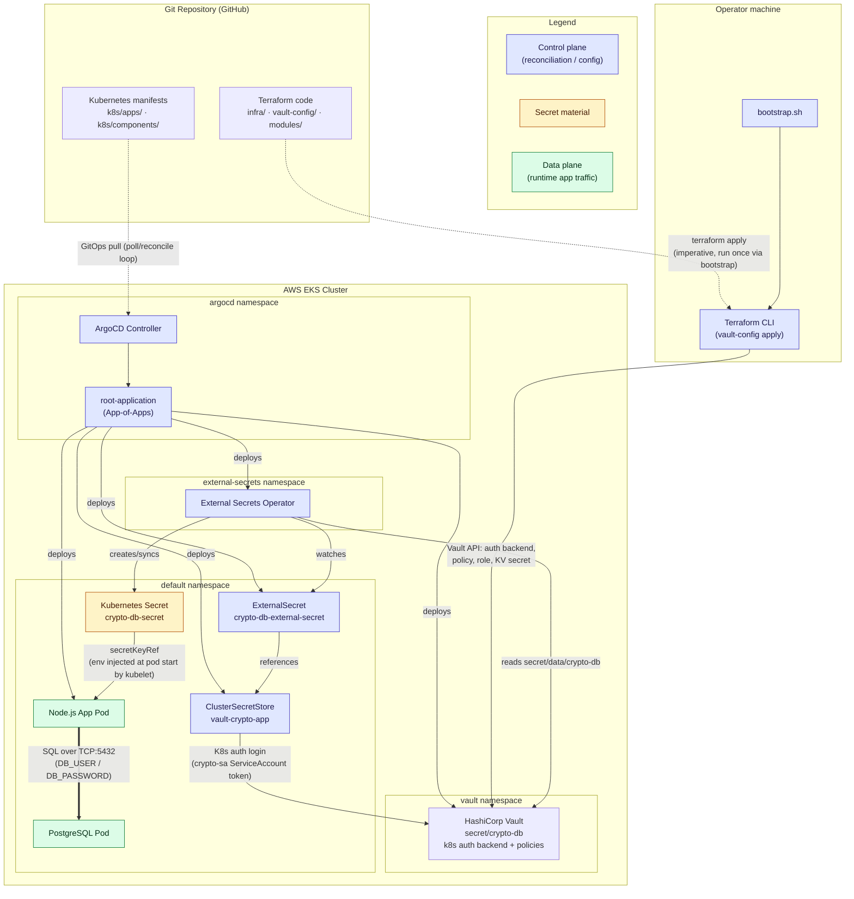

```mermaid
flowchart TB
    subgraph LEGEND["Legend"]
        direction LR
        L1["Control plane\n(reconciliation / config)"]:::controlplane
        L2["Secret material"]:::secretstore
        L3["Data plane\n(runtime app traffic)"]:::dataplane
    end

    subgraph GIT["Git Repository (GitHub)"]
        TFCODE["Terraform code\ninfra/ · vault-config/ · modules/"]
        K8SMANIFESTS["Kubernetes manifests\nk8s/apps/ · k8s/components/"]
    end

    subgraph OPERATOR["Operator machine"]
        BOOTSTRAP["bootstrap.sh"]
        TF["Terraform CLI\n(vault-config apply)"]
    end

    subgraph EKS["AWS EKS Cluster"]
        subgraph ARGONS["argocd namespace"]
            ARGOCD["ArgoCD Controller"]
            ROOTAPP["root-application\n(App-of-Apps)"]
        end

        subgraph VAULTNS["vault namespace"]
            VAULT["HashiCorp Vault\nsecret/crypto-db\nk8s auth backend + policies"]
        end

        subgraph ESONS["external-secrets namespace"]
            ESO["External Secrets Operator"]
        end

        subgraph DEFAULTNS["default namespace"]
            CSS["ClusterSecretStore\nvault-crypto-app"]
            EXTSEC["ExternalSecret\ncrypto-db-external-secret"]
            K8SSECRET["Kubernetes Secret\ncrypto-db-secret"]:::secretstore
            NODEAPP["Node.js App Pod"]:::dataplane
            PG["PostgreSQL Pod"]:::dataplane
        end
    end

    K8SMANIFESTS -. "GitOps pull (poll/reconcile loop)" .-> ARGOCD
    ARGOCD --> ROOTAPP
    ROOTAPP -- "deploys" --> VAULT
    ROOTAPP -- "deploys" --> ESO
    ROOTAPP -- "deploys" --> CSS
    ROOTAPP -- "deploys" --> EXTSEC
    ROOTAPP -- "deploys" --> NODEAPP

    TFCODE -. "terraform apply\n(imperative, run once via bootstrap)" .-> TF
    BOOTSTRAP --> TF
    TF -- "Vault API: auth backend,\npolicy, role, KV secret" --> VAULT

    ESO -- "watches" --> EXTSEC
    EXTSEC -- "references" --> CSS
    CSS -- "K8s auth login\n(crypto-sa ServiceAccount token)" --> VAULT
    ESO -- "reads secret/data/crypto-db" --> VAULT
    ESO -- "creates/syncs" --> K8SSECRET
    K8SSECRET -- "secretKeyRef\n(env injected at pod start by kubelet)" --> NODEAPP
    NODEAPP == "SQL over TCP:5432\n(DB_USER / DB_PASSWORD)" ==> PG

    classDef controlplane fill:#e0e7ff,stroke:#4338ca,color:#1e1b4b
    classDef dataplane fill:#dcfce7,stroke:#15803d,color:#052e16
    classDef secretstore fill:#fef3c7,stroke:#b45309,color:#451a03

    class ARGOCD,ROOTAPP,ESO,CSS,EXTSEC,TF,BOOTSTRAP controlplane
```
